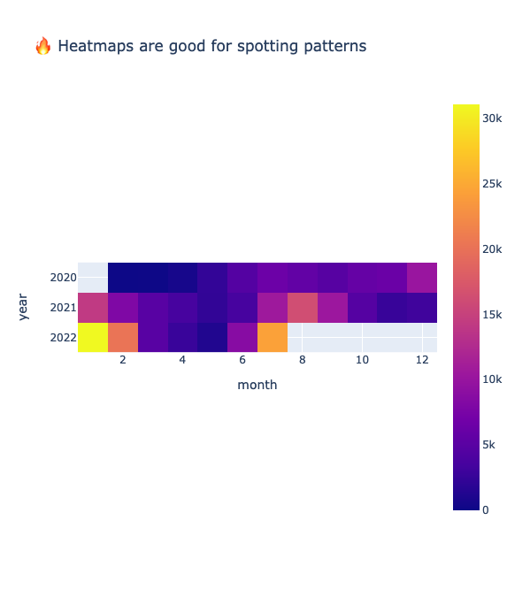

# Good dataviz, bad dataviz

A showcase of good practices in data visualization to improve understanding of your data.

This is built using Python. The data used is Covid cases in Mexico collected from the [World in Data](https://github.com/owid/covid-19-data/tree/master/public/data/latest) repo.

# Guidelines

## 0. Your go-to chart types are line and bar charts

For reasons we'll see below, humans can only quantify difference through height or length.

So relying on color, volume and angles are not well suited for representing difference.

## 1. Remove redundancy

Attention is very limited. With every detail you add, you increase cognitive effort.

Remove everything that doesn't compromise your core message, i.e. gridlines, colors, 3D graphs, etc.

Especially, 3D plots. It takes massive brain power to process them.

## 2. Favor length and position.

Humans are able to quantify better attributes such as length and position.

Color differences, areas or angles require tools or legends to help us quantify the difference.

Which of the following is easier to understand?

## 3. Decide between showing patterns or details

The type of graph you'll use depends on that decision.

For patterns, use heatmaps and bubble maps. We can't quantify difference, but color enables us to spot clusters better.

For details, lines and bar graphs.

## 4. Choose axes ranges wisely

Your default range for the y axis should start at zero. The overall suggestion is:

- When absolute figures are important, it should start at zero.

- When your focus is change, your y axis can be zoomed-in. But this can lead to misrepresentations!

